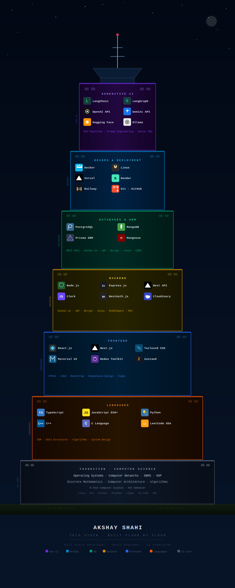

# Akshay Shahi

**Full Stack Developer · GenAI Engineer · CS Undergrad**

*Building production-grade web applications and intelligent systems*

---

## About

I'm a Computer Science undergraduate (B.Tech, 6th Semester) with a strong focus on full-stack web development and generative AI engineering. I work across the entire stack — from designing databases and building APIs to crafting performant frontend experiences and integrating LLM-powered systems.

Currently deepening my expertise in **AI agent architectures**, **RAG pipelines**, and **distributed backend systems** while sharpening my **DSA** fundamentals.

---

## Tech Stack

  

---

## GitHub Stats

---

Open to collaborations, internships, and interesting problems &nbsp;·&nbsp; <a href="mailto:akshayofficial070@gmail.com">akshayofficial070@gmail.com</a>

